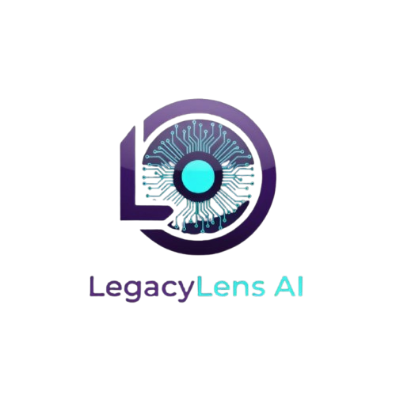
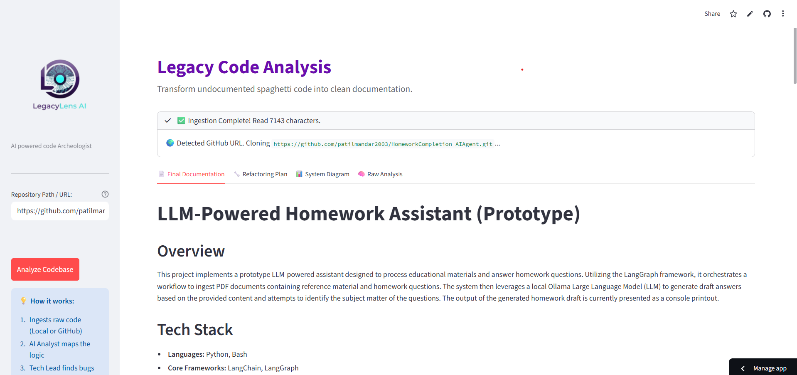
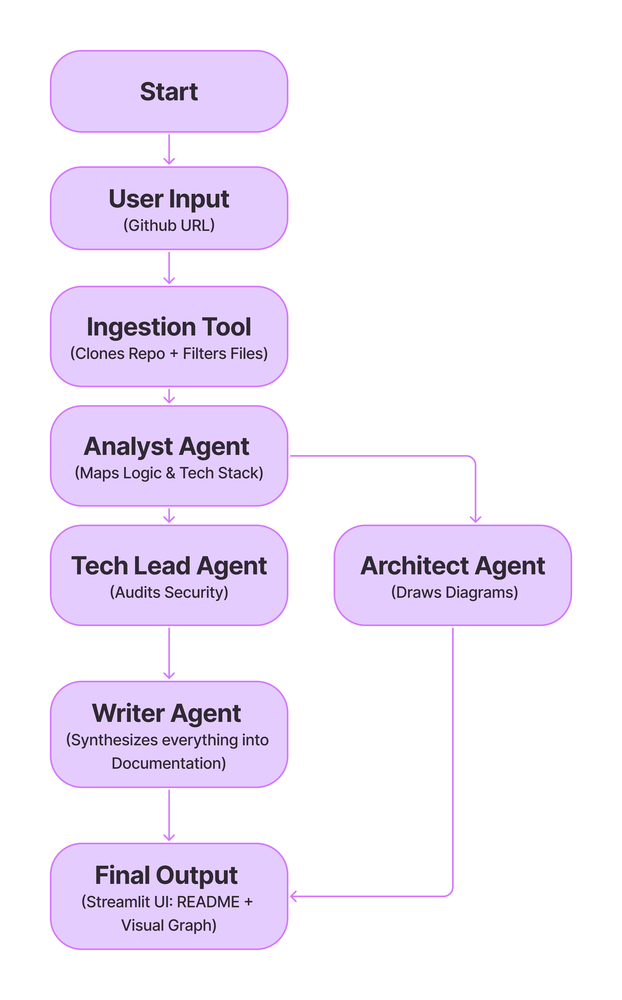

<div align="center">

<h1>LegacyLens AI</h1>
<h3>The Autonomous Code Archeologist</h3>

<p>
<b>Turn "Spaghetti Code" into Professional Documentation with a Multi-Agent Team.</b>
</p>

<!-- REPLACE THIS LINK WITH YOUR ACTUAL STREAMLIT APP LINK -->

<a href="https://legacylens-ai.streamlit.app/">

</a>
<a href="https://www.google.com/search?q=https://youtu.be/YOUR_VIDEO_ID">

</a>
</div>

🎯 The Problem

"Why does this variable exist?" "Who wrote this?" "If I touch this line, will the server explode?"

Every developer knows the pain of inheriting legacy code. Studies show developers spend 50-75% of their time simply reading and trying to understand existing code rather than writing new features. Documentation is often missing, outdated, or written by someone who left the company 3 years ago.

We are drowning in code but starving for context.

🚀 The Solution

LegacyLens AI is not just a code summarizer; it is an autonomous team of specialized AI agents that work together to reverse-engineer undocumented systems.

Instead of a single LLM trying to do everything, LegacyLens mimics a real-world engineering team:

🕵️ The Analyst: Clones & reads raw code to map data flow.

🚩 The Tech Lead: Audits the code for security risks and "smells."

📝 The Writer: Compiles everything into professional documentation.

📊 The Architect: Visualizes the system structure automatically.

📸 Screenshots



⚙️ Architecture & Agentic Workflow

LegacyLens utilizes a Sequential Multi-Agent Pipeline powered by Google Gemini 2.5 Flash.


1. The "Hands" (Tool Use)

The system creates an autonomous Ingestion Tool (ingest_code.py).

Detects if input is a GitHub URL.

Uses Python's subprocess to execute real git clone commands.

Traverses the file system, filtering out noise (node_modules, .git) to prepare a high-density context window.

2. The "Brains" (The Agent Chain)

Agent 1: The Analyst (Context Ingestor)

Task: Ingests raw code (up to 800k characters). Identifies tech stacks, entry points, and core logic.

Agent 2: The Tech Lead (Auditor)

Task: Critiques the Analyst's report. It looks for security vulnerabilities (hardcoded keys), deprecated libraries, and anti-patterns.

Agent 3: The Writer (Synthesizer)

Task: Synthesizes findings into a standard README.md format (Installation, Usage, Features).

Agent 4: The Architect (Visualizer)

Task: Generates raw Mermaid.js graph definitions to visually map file dependencies.

🛠️ Tech Stack

Model: Google Gemini 2.5 Flash (Optimized for massive context windows).

Framework: Streamlit (UI).

Orchestration: Custom Python Agent Classes with System Prompting.

Tools: Git (via subprocess), shutil for file management.

Visualization: Mermaid.js (rendered via mermaid.ink API).

✨ Key Features (Competition Tracks)

🌍 Universal Repository Loader: Works on ANY public GitHub repository URL.

🛡️ Context Guard: Automatically detects massive repositories and truncates context to prevent token limit crashes while preserving core logic.

👀 Visual Architecture: Automatically draws system diagrams—no drag-and-drop required.

🚩 Automated Auditing: Doesn't just explain code; warns you about security risks.

🏁 Getting Started Locally

Clone the repository:
``` bash
git clone [https://github.com/your-username/legacylens-ai.git](https://github.com/your-username/legacylens-ai.git)
cd legacylens-ai
```

Install dependencies:
``` bash
pip install -r requirements.txt
``` 

Set up your API Key:
Create a .env file and add your Google Gemini Key:

``` env
GOOGLE_API_KEY=your_key_here
```

Run the Agent:

``` python
streamlit run app.py
```

Submitted for the Google AI Agents Intensive Hackathon 2025 - Enterprise Track
